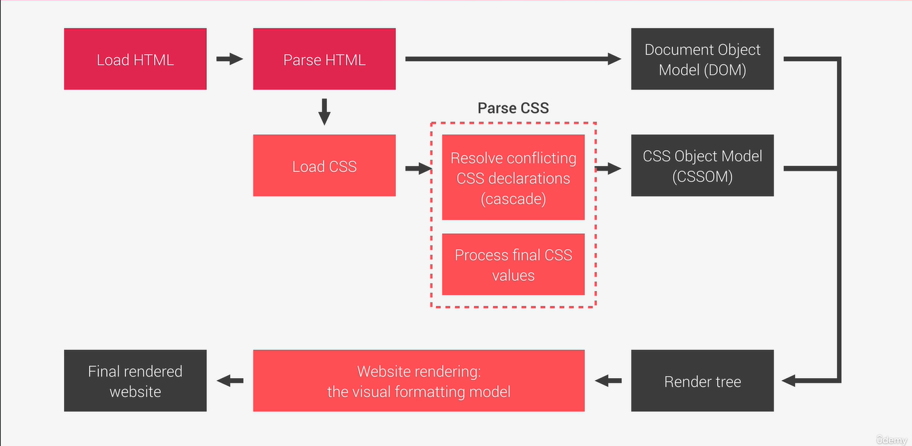

<!-- Como funciona o CSS atrás dos panos -->

1. O CSS é carregado depois que o HTML é analisado e encontra as stylesheets (CSS)...
2. O CSS é analisado pelo navegador com dois procedimentos principais:
    - Resolve conflitos de declaração.
    - Processa os valores finais. <!-- Cada dispositivo possui um tamanho diferente então os valores mudam -->
3. O CSS é guardado em um arquivo similar ao DOM chamado de CSS Object Model (CSSOM).
4. O CSS se junta com o HTML e é renderizado para o site final.

